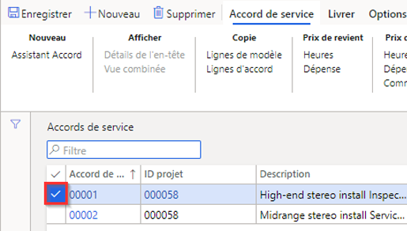
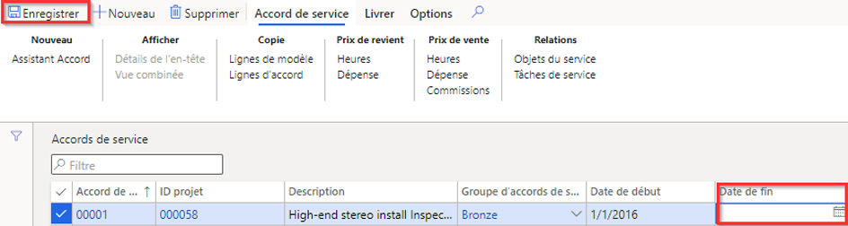

---
lab:
    title: 'Labo 7 : Créer un ordre de travail prévisionnel'
    module: 'Module 1 : Découvrir les principes de base de Microsoft Dynamics 365 Supply Chain Management'
---

## Labo 7 : Créer un ordre de travail prévisionnel

## Objectifs

Les ordres de maintenance créés dans le système décrivent l’intervention de maintenance ou la réparation nécessaire sur un actif et affectent les ressources appropriées pour traiter la demande. Votre entreprise a un contrat de service en cours et doit s’assurer que les ordres de travail prévisionnels sont créés afin de prendre en charge la maintenance prévue des articles du contrat.

## Mise en place du labo

   - **Durée estimée** : 10 minutes

## Instructions

1. Sur la page d’accueil de Finance and Operations, en haut à droite, vérifiez que vous travaillez avec la société USMF.

1. Si nécessaire, sélectionnez la société, puis, dans le menu, **USMF.**

1. Dans le volet de navigation de gauche, sélectionnez **Modules** > **Gestion des services** > **Contrats de service** > **Accords de service**.

1. Cochez la case dans la première colonne du premier accord de service.

    

1. Cochez la case **Date de fin** et supprimez la valeur actuelle, puis, dans le menu supérieur, sélectionnez **Enregistrer**.  
 La date de fin est supprimée pour qu’une commande de service puisse être créée pour cet accord.

    

1. Dans le menu en haut, sélectionnez **Livrer**.

1. Sur la barre de ruban, sous **Créer**, sélectionnez **Commandes de service planifiées**.

1. Dans le volet Créer des commandes de service, sous **PÉRIODE**, définissez la **Date de début** à la date du jour et la **Date de fin** à deux jours plus tard.

1. Sous **INFOLOG**, sélectionnez la bascule **Afficher la fenêtre Infos** pour la définir sur **Oui**.  
Une liste des commandes de service qui sont créées dans l’accord s’affiche.

1. Sous **INCLURE LES TYPES DE TRANSACTION**, utilisez l’option **Heures** pour la définir sur **Oui**.  
Les types de transaction représentent les lignes qui sont créées dans l’accord de service et chaque type de transaction que vous sélectionnez génère plusieurs commandes de service, en fonction de l’intervalle de service spécifié sur la ligne de l’accord de service.

1. Sous **OPTION**, sélectionnez la bascule **Continu** pour la définir sur **Oui**.  
Cette opération permet de créer toutes les commandes de service qui manquent dans une série continue de commandes de service.

1. Sélectionnez **OK**.
